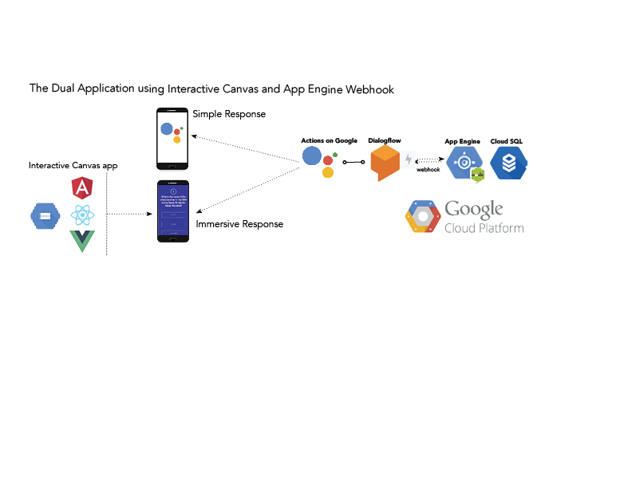
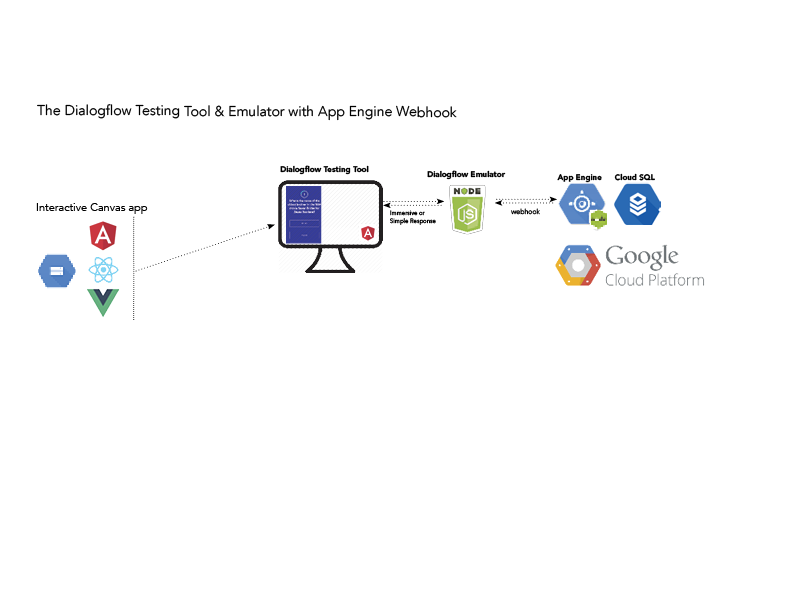

# Dialogflow Testing Tool

This respository contains a testing framework that was as part of the creation of an [Interactive Canvas](https://developers.google.com/actions/interactivecanvas/) application using Dialogflow.

Specifically the testing framework allows the all-local testing of the entire application stack, inlcluding the Canvas app and the Webhook app, without having to go through the cloud. This was set-up was found to be extremely useful in debugging issues in the Canvas app, and it communication with the baackend.

The repository here contains an Angular 6 app which serves as the front-end of the testing framework. It must be used in conjunction with the [Dialogflow Emulator](https://github.com/matthew-trump/dialogflow-emulator), a Node Express server which serves as the local surrogate for Dialogflow itself. It is possible that both of these components could be placed togther in a monorepository at some point, since are meant to be used together.

In general, one considers such applications to be "dual appications," in that the it provides an Immersive Response to surfaces that support this capability, as well as a traditional, message-scroll Simple Response for surfaces that do notsupport the Custom Stage actions capability.

This project was generated with [Angular CLI](https://github.com/angular/angular-cli) version 6.2.9.

## Development server

Run `ng serve` for a dev server. Navigate to `http://localhost:4200/`. The app will automatically reload if you change any of the source files.

## Code scaffolding

Run `ng generate component component-name` to generate a new component. You can also use `ng generate directive|pipe|service|class|guard|interface|enum|module`.

## Build

Run `ng build` to build the project. The build artifacts will be stored in the `dist/` directory. Use the `--prod` flag for a production build.

## Running unit tests

Run `ng test` to execute the unit tests via [Karma](https://karma-runner.github.io).

## Running end-to-end tests

Run `ng e2e` to execute the end-to-end tests via [Protractor](http://www.protractortest.org/).

## Further help

To get more help on the Angular CLI use `ng help` or go check out the [Angular CLI README](https://github.com/angular/angular-cli/blob/master/README.md).
